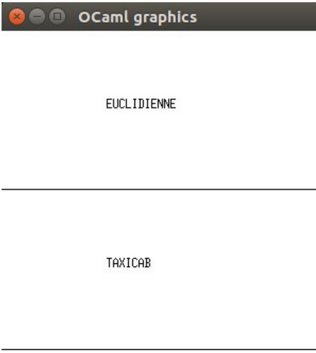
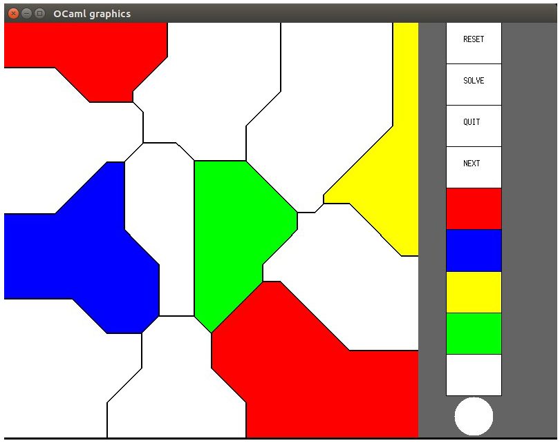

How to compile ?
---------------------------

There's two ways of compiling the project into one executable/

1. Directly write "ocamlbuild -pkg graphics jeu.native" in a terminal.

2. A given makefile allows it by writing "make" in a terminal.

An attempt of building a makefile which would have created an executable without ocamlbuild was made. However, a targetting error from the last rule appeared when the last rule was executed. To check this behaviour: "make other" in a terminal.

How to clean working directory ?
-------------------------------

To delete .cmo and .cmi files => "make clean" in a terminal.

To delete all executables => "make mrproper" in the terminal.

How to use the produced executable ?
--------------------------------------

Once compilation's done, the ".native" file can be executed => "./jeu.native"
You will then be able to choose a distance (as shown in the image below) and start to play !

The "next" button allows to go to the next Voronoi, "reset" permits to clean the actual Voronoi and "quit" pushes you in another dimension called "reality" (WOW). You can see below what the game looks like:

Vous pouvez ci dessous voir la fenêtre de jeu complète :

How to add new Voronois ?

Comment ajouter des voronois au jeu ?
------------------------------------

You can add them either directly in "examples.ml", or in the list at the end of the former.
